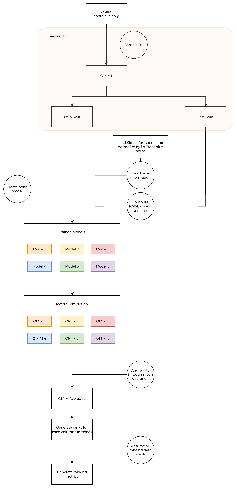

# NEGradient_GenePriority

[](https://codecov.io/gh/azimgivron/NEGradient_GenePriority)

<p align="center" width="100%">
    
</p>

The repository **NEGradient_GenePriority** (short for "Non-Euclidean Gradient Methods for Matrix Completion in Gene Prioritization") provides the code and data to reproduce the results presented in the paper "[Gene prioritization using Bayesian matrix factorization with genomic and phenotypic side information.](https://pubmed.ncbi.nlm.nih.gov/29949967/)" This study introduces a novel method for gene prioritization by combining Bayesian matrix factorization (BMF) with genomic and phenotypic side information, enabling robust predictions and improved identification of disease-associated genes.

---

## Overview

<p align="center" width="100%">
    
</p>

1. **Problem Formulation**:  
   - **Input**: Matrix $O$ of gene-disease associations ($O_{ij} = 1$ for known associations, $O_{ij} = 0$ for unknown or missing associations).  
   - **Objective**: Predict potential associations $\hat{O}$, where $\hat{O}_{ij}$ are floating-point scores indicating the likelihood of gene-disease associations.

2. **Data Preparation**:  
   - **Positive Class**: Known gene-disease associations ($O_{ij} = 1$).  
   - **Negative Class**: Randomly sampled negatives ($O_{ij} = 0$), ensuring no overlap with positives.  
   - **Unknown Class**: Represented as missing values in the sparse encoding.  
   - **Procedure**:  
     - **Generate Negative Samples**: Randomly sample negatives and merge with the positive class to form $O_1$.  
     - **Create Train-Test Splits**: Split $O_1$ into train and test sets across six random iterations for cross-validation.

3. **Incorporating Side Information**:  
   - Load side information (e.g., gene or disease features) and normalize using the Frobenius norm.  
   - Integrate side information into the training process to enhance predictions.

4. **Model Training**:  
   - Train matrix completion models on the train split of $O_1$, using side information.  
   - Compute the Root Mean Squared Error (RMSE) during training as a measure of model performance.  
   - Repeat training across six random splits to yield six independent models, $M_i \quad \forall i \in \set{1,2,3,4,5,6}$.

5. **Matrix Completion**:  
   - Use the trained models to generate the completed matrix, generating six predicted matrices ($\hat{O_i} \quad \forall i \in \set{1,2,3,4,5,6}$) with floating-point scores.  
   - Aggregate the six matrices using a mean operation to produce $\bar{O}$ (averaged matrix).

6. **Model Testing and Ranking**:  
   - Rank genes for each disease (columns of $\bar{O}$) based on the predicted scores.  
   - Assume missing values are zeros for ranking purposes.  
   - Use only positive associations from the test set for evaluation. For each disease, highly ranked genes in $\bar{O}$ should correspond to true positive associations.

7. **Evaluation and Metrics**:  
   - Compute ranking metrics to assess the quality of predictions, focusing on the ability of the model to rank true positive associations higher.  
   - Metrics are aggregated across the six splits to ensure robustness.

---

## Dataset Generation

The above procedure describes the general approach. However, the reference paper uses two datasets, OMIM1 and OMIM2, respectively named  $O_1$ and $O_2$. The procedure for $O_2$ differs in the following way:

- Subset Relationship: $O_2$ is a subset of $O_1$.
- Model Generation: For $O_2$, models are generated using an N-Fold cross-validation approach, rather than the N random splits used for $O_1$.  

### OMIM1 Dataset Construction

**Input**:  
- Gene-disease DataFrame: $d$  
- Number of splits: $N$  
- Sparsity factor $\alpha$, the ratio of 0s to 1s.  

**Output**:  
- Unified sparse matrices: $O_{1_{i}} \quad \forall i \in \{1, N\}$  
- Combined splits: $S_{1_{i}} \quad \forall i \in \{1, N\}$  

**Procedure**:  
1. Convert $d$ into a sparse matrix $O_{1_{1s}}$.  
2. Sample $N$ zero matrices $O_{1_{0s, i}}$ from $O_{1_{1s}}$ using $\alpha \quad \forall i \in \{1, N\}$.  
3. Combine $O_{1_{1s}}$ and $O_{1_{0s, i}}$ into unified matrices $O_{1_{i}} \quad \forall i \in \{1, N\}$.  
4. Split $O_{1_{1s}}$ indices randomly into subsets $S_{1_{1s}}$.  
5. Split $O_{1_{0s, i}}$ indices randomly into subsets $S_{1_{0s, i}} \quad \forall i \in \{1, N\}$.  
6. Merge splits from positive ($S_{1_{1s}}$) and zero ($S_{1_{0s, i}}$) samples into $S_{1_{i}} \quad \forall i \in \{1, N\}$.  

---

### OMIM2 Dataset Construction

**Input**:  
- Gene-disease DataFrame: $d$  
- Number of folds: $N$  
- Association threshold: $T$  
- Sparsity factor $\alpha$, the ratio of 0s to 1s.  

**Output**:  
- Unified sparse matrix: $O_2$
- Combined folds: $S_2$  

**Procedure**:  
1. Filter diseases with fewer than $T$ associations.  
2. Convert $d$ into a sparse matrix $O_{2_{1s}}$.  
3. Sample zeros from $O_{2_{1s}}$ using $\alpha$.  
4. Combine $O_{2_{1s}}$ and $O_{2_{0s}}$ into a unified matrix $O_2$.  
5. Split $O_{2_{1s}}$ indices randomly into subsets $S_{2_{1s}}$.  
6. Split $O_{2_{0s}}$ indices randomly into subsets $S_{2_{0s}}$.  
7. Merge splits from positive ($S_{2_{1s}}$) and zero ($S_{2_{0s}}$) samples into $S_2$.  

---

## Installation

**Steps**:

1. Clone the repository:
   ```bash
   git clone https://github.com/azimgivron/NEGradient_GenePriority.git
   cd NEGradient_GenePriority
   ```

2. Create and activate a virtual environment:
   ```bash
   python -m venv venv
   source venv/bin/activate
   ```

3. Upgrade pip and install dependencies:
   ```bash
   pip install --upgrade pip
   pip install -r requirements.txt
   ```

---

## Requirements

- Python 3.11  
- pip (Python package installer)  
- Virtual environment (venv) module  

---

## Usage

Run the main script to reproduce the results:

```bash
python main.py
```

This script performs gene prioritization using Bayesian matrix factorization with genomic and phenotypic side information.

---

## Repository Structure

- **`NEGradient_GenePriority/`**: Main modules for preprocessing, matrix operations, and evaluation.
- **`main.py`**: Main script for running the gene prioritization pipeline.
- **`requirements.txt`**: List of dependencies for the project.
- **`Dockerfile`**: Configuration for containerized deployment.
- **`pyproject.toml`**: Project and dependency configuration for building and distribution.
- **`.gitignore`**: Specifies files to ignore in the repository.
- **`LICENSE`**: Project license.

---

## Key Features

1. **Matrix Completion with Bayesian Matrix Factorization (BMF)**:  
   - Predicts gene-disease associations based on sparse data.

2. **Support for Genomic and Phenotypic Side Information**:  
   - Combines genomic and phenotypic data to improve prioritization accuracy.

3. **Flexible Preprocessing and Evaluation**:  
   - Tools for data preprocessing, creating folds/splits, and computing metrics like ROC-AUC and BEDROC.

---

## License

This project is licensed under the MIT License. See the [LICENSE](LICENSE) file for details.

---

## Contact

For questions, suggestions, or issues, please open an issue on the repository.